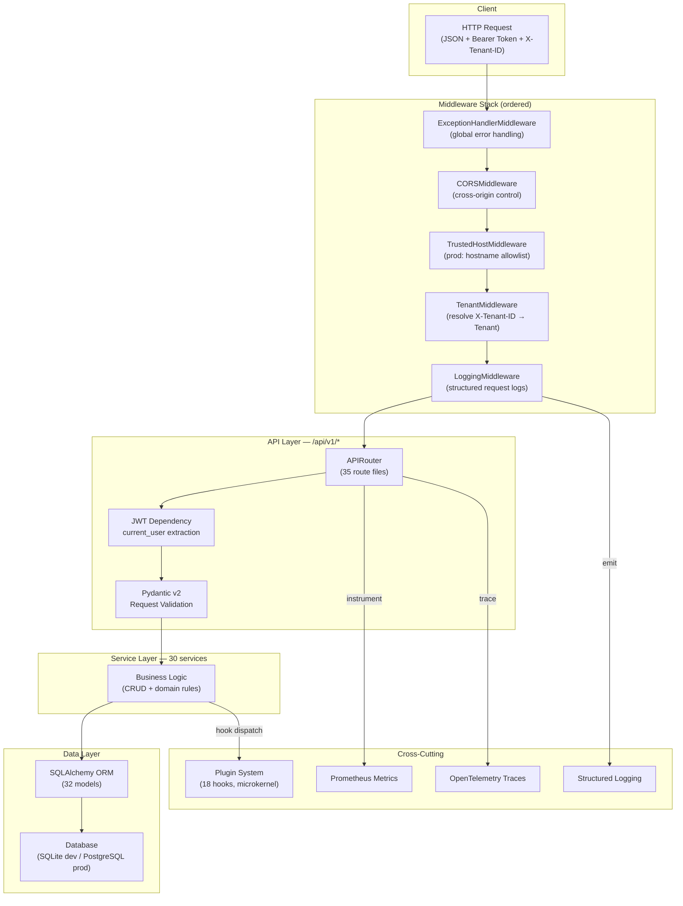
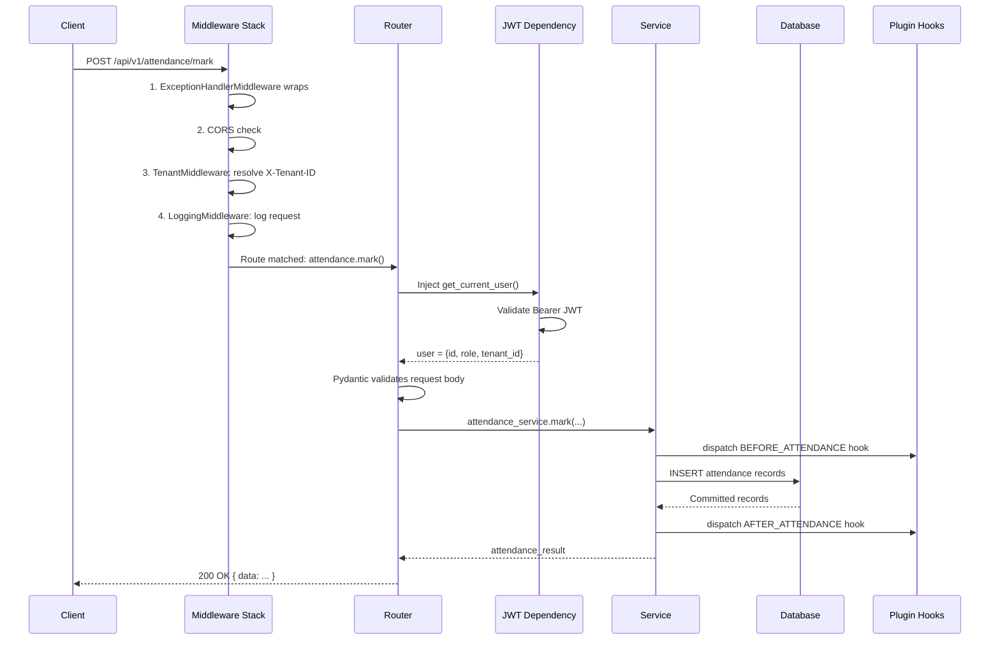
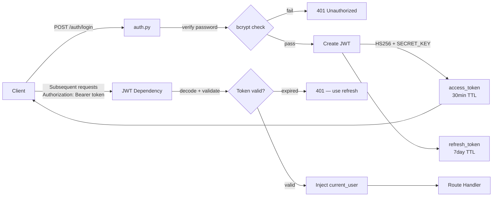

# Backend Architecture — PreSkool ERP

The FastAPI backend follows a **layered service architecture** with clear separation between API routing, business logic, data access, and infrastructure concerns.

---

## Layer Diagram



---

## Directory Structure

```
backend/
├── app/
│   ├── main.py                  # FastAPI app factory + middleware registration
│   ├── api/
│   │   └── v1/                  # 35 route files (one per module)
│   │       ├── __init__.py      # api_router aggregation
│   │       ├── auth.py
│   │       ├── students.py
│   │       └── ...
│   ├── models/                  # SQLAlchemy ORM models (32 files)
│   ├── schemas/                 # Pydantic v2 request/response schemas (31 files)
│   ├── services/                # Business logic (30 files)
│   ├── core/
│   │   ├── config.py            # Settings (env vars via pydantic-settings)
│   │   ├── database.py          # Engine, SessionLocal, Base
│   │   ├── security.py          # JWT, bcrypt, rate limiting, CSRF
│   │   ├── middleware.py        # Custom middleware classes
│   │   ├── logging_config.py    # Structured logging setup
│   │   ├── metrics.py           # Prometheus setup
│   │   └── tracing.py           # OpenTelemetry setup
│   ├── plugins/                 # Microkernel plugin system
│   │   ├── __init__.py          # PluginBase, HookType, PluginContext
│   │   ├── registry.py          # Hook dispatch, singleton registry
│   │   ├── loader.py            # Filesystem discovery + dynamic import
│   │   ├── birthday_notifications.py
│   │   └── attendance_alerts.py
│   └── tests/                   # pytest test suite
├── alembic/                     # Database migrations (22 versions)
├── seeds/                       # Seed data scripts
└── requirements.txt
```

---

## Request Lifecycle



---

## Authentication Flow



---

## Database Session Management

Each request gets an injected `db: Session` via FastAPI's dependency injection:

```python
def get_db():
    db = SessionLocal()
    try:
        yield db
    finally:
        db.close()
```

Services receive the session, perform operations, and the session is committed (or rolled back) within the service method.

---

## Key Patterns

### Service Pattern
All business logic lives in `services/`. Services are stateless functions receiving `(db, **kwargs)`:

```python
# services/student_service.py
def get_students(db: Session, page: int, limit: int, search: str) -> dict:
    query = db.query(Student)
    if search:
        query = query.filter(Student.first_name.ilike(f"%{search}%"))
    total = query.count()
    students = query.offset((page-1)*limit).limit(limit).all()
    return {"data": students, "total": total, "page": page}
```

### Schema-Driven Validation
Every endpoint uses Pydantic v2 schemas for both request body validation and response serialization. Schemas live in `schemas/` mirroring the `models/` structure.

### Error Handling
All errors propagate through `ExceptionHandlerMiddleware` which catches:
- `HTTPException` — re-raised with structured JSON
- `SQLAlchemyError` — mapped to 500 with logging
- All unhandled exceptions — 500 with sanitized message (no stack traces in prod)
