# Data Flow — PreSkool ERP

This document describes how data flows through the PreSkool ERP system from browser to database and back, covering authentication, multi-tenancy, validation, and plugin hook dispatch.

---

## Full Request Lifecycle

```mermaid
flowchart TD
    Browser["🌐 Browser\nReact + Redux"] 
    
    subgraph Interceptor["Axios Interceptor"]
        AttachAuth["Attach Authorization: Bearer token\nAttach X-Tenant-ID header"]
    end
    
    subgraph NginxProxy["Nginx Reverse Proxy"]
        SSL["TLS Termination"]
        Route["Route: /api → backend\nRoute: / → frontend"]
    end
    
    subgraph Middleware["FastAPI Middleware Stack"]
        EH["ExceptionHandlerMiddleware\n(try-catch wrapper)"]
        CORS["CORSMiddleware\n(origin allowlist)"]
        THM["TrustedHostMiddleware\n(prod only)"]
        TM["TenantMiddleware\n→ resolves X-Tenant-ID\n→ injects tenant in request.state"]
        LM["LoggingMiddleware\n→ logs method, path, status, latency"]
    end
    
    subgraph FastAPICore["FastAPI Core"]
        RMatch["Router Match\n/api/v1/{module}/{path}"]
        JWTDep["JWT Dependency\nget_current_user()\n→ decode HS256 token\n→ extract sub, role, tenant_id"]
        Pydantic["Pydantic v2 Validator\n→ request body / query params\n→ 422 on validation failure"]
    end
    
    subgraph ServiceLayer["Service Layer"]
        BizLogic["Business Logic\n→ domain rules\n→ authorization (role check)"]
        HookBefore["Plugin Hook: BEFORE_*\n(optional, non-blocking)"]
        SQLAlchemy["SQLAlchemy ORM\n→ build query\n→ execute SQL"]
        HookAfter["Plugin Hook: AFTER_*\n(optional, async-compatible)"]
    end
    
    subgraph Database["Database"]
        Postgres["PostgreSQL / SQLite\n58 tables"]
    end
    
    Browser -->|"HTTP Request"| AttachAuth
    AttachAuth --> SSL
    SSL --> Route --> EH
    EH --> CORS --> THM --> TM --> LM
    LM --> RMatch --> JWTDep --> Pydantic
    Pydantic --> BizLogic
    BizLogic --> HookBefore --> SQLAlchemy
    SQLAlchemy <--> Postgres
    SQLAlchemy --> HookAfter
    HookAfter -->|"Pydantic response model\nJSON serialization"| Browser
```

---

## Authentication Token Flow

---

## Tenant Isolation Flow

---

## File Upload Flow

---

## Payment Flow

---

## Notification Fan-out

> **Note:** Real-time WebSocket delivery is tracked as a future enhancement. Currently, frontend polls `/notifications/unread/count` every 30 seconds.
