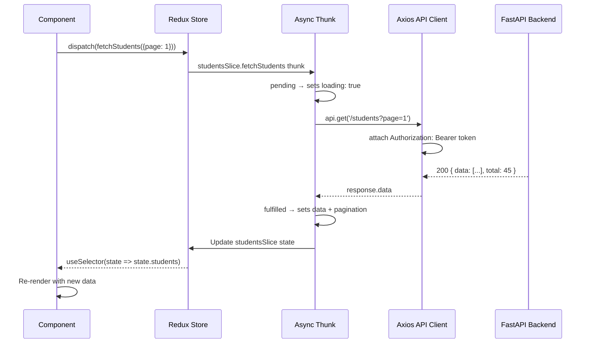

# Frontend Architecture — PreSkool ERP

The React frontend uses **Redux Toolkit** for state management, **MUI** for UI components, and **Vite** as the build tool. The app is structured around feature-based pages with a shared component library.

---

## Technology Stack

| Library | Version | Purpose |
|---------|---------|---------|
| React | 18 | UI rendering |
| TypeScript | 5 | Type safety |
| Vite | 5 | Build tool + dev server |
| MUI (Material UI) | 5 | Component library + theming |
| Redux Toolkit | 2 | Global state management |
| React Router | 6 | Client-side routing |
| Axios | 1 | HTTP client |
| React Query | — | Server state + caching (selected pages) |

---

## Application Architecture

```mermaid
graph TB
    subgraph Browser
        URL["URL / Route"]
    end

    subgraph ReactApp["React App (App.tsx)"]
        Router["React Router v6\n46+ routes"]
        
        subgraph PublicRoutes["Public Routes"]
            Login["LoginPage"]
            Register["RegisterPage"]
            Forgot["ForgotPasswordPage"]
        end
        
        subgraph ProtectedRoutes["Protected Routes (PrivateRoute)"]
            Layout["DashboardLayout\n(AppBar + Sidebar + Outlet)"]
            
            subgraph Pages["39 Pages"]
                Dashboard["DashboardPage"]
                Students["StudentsListPage\nAddStudentPage\nEditStudentPage"]
                Academic["ClassesListPage\nSubjectsListPage\nTimetablePage\nExamsPage\nGradesPage"]
                HRM["AttendancePage\nLeavePage\nPayrollPage"]
                Finance["FeesPage\nPaymentsPage"]
                More["...28 more pages"]
            end
        end
    end

    subgraph StateLayer["State Layer — Redux Store"]
        Store["Redux Store\n32 slices"]
        Slices["authSlice\nstudentsSlice\nteachersSlice\n...29 more"]
        Thunks["Async Thunks\n(API calls)"]
    end

    subgraph APILayer["API Service Layer"]
        ApiService["api.ts (Axios instance)\nBase URL + Auth interceptor\nToken refresh interceptor"]
    end

    URL --> Router
    Router --> PublicRoutes
    Router --> Layout --> Pages
    Pages -->|dispatch(thunk)| Store
    Store --> Slices --> Thunks
    Thunks -->|axios request| ApiService
    ApiService -->|HTTP| Backend["FastAPI Backend"]
    Backend -->|JSON response| ApiService
    ApiService --> Thunks --> Slices -->|useSelector| Pages
```

---

## Directory Structure

```
frontend/src/
├── App.tsx                  # Root router + route definitions
├── main.tsx                 # React entry point + Redux Provider
├── layouts/
│   └── DashboardLayout.tsx  # AppBar + Sidebar + Outlet + GlobalSearch
├── pages/                   # 39 page components (feature directories)
│   ├── auth/                # Login, Register, ForgotPassword, ResetPassword
│   ├── dashboard/           # DashboardPage
│   ├── students/            # StudentsListPage, AddStudentPage, EditStudentPage
│   ├── teachers/            # TeachersListPage, AddTeacherPage, EditTeacherPage
│   ├── classes/             # ClassesListPage
│   ├── subjects/            # SubjectsListPage
│   ├── rooms/               # RoomsManagementPage
│   ├── guardians/           # GuardiansListPage, AddGuardianPage, EditGuardianPage
│   ├── departments/         # DepartmentsPage
│   ├── syllabus/            # SyllabusPage
│   ├── timetable/           # TimetablePage
│   ├── exams/               # ExamsPage
│   ├── grades/              # GradesPage
│   ├── attendance/          # AttendancePage
│   ├── leaves/              # LeavePage
│   ├── payroll/             # PayrollPage
│   ├── fees/                # FeesPage
│   ├── payments/            # PaymentsPage
│   ├── library/             # LibraryPage
│   ├── hostel/              # HostelPage
│   ├── transport/           # TransportPage
│   ├── sports/              # SportsPage
│   ├── reports/             # ReportsPage
│   ├── notifications/       # NotificationCenter
│   ├── files/               # FileManagerPage
│   ├── settings/            # SettingsPage
│   ├── plugins/             # PluginsPage
│   ├── student-dashboard/   # StudentDashboardPage
│   ├── teacher-dashboard/   # TeacherDashboardPage
│   └── parent-dashboard/    # ParentDashboardPage
├── store/                   # Redux store + 32 slices
│   ├── index.ts             # Store configuration
│   ├── authSlice.ts
│   ├── studentsSlice.ts
│   └── ...30 more slices
├── components/              # Shared components
│   ├── GlobalSearch.tsx      # Header search bar
│   ├── NotificationDropdown.tsx
│   └── ...
├── services/
│   └── api.ts               # Axios instance + interceptors
└── theme/
    └── theme.ts             # MUI theme configuration
```

---

## Redux Data Flow



---

## Authentication Guard

`PrivateRoute` component wraps all protected routes. It reads `authSlice.token` from the Redux store. If no token is present, it redirects to `/login`.

The Axios interceptor automatically:
1. Attaches `Authorization: Bearer <token>` to every request
2. On `401` response → calls `POST /auth/refresh` 
3. If refresh succeeds → retries original request
4. If refresh fails → dispatches `logout()` → redirects to `/login`

---

## Role-Based UI

The sidebar navigation adapts dynamically based on the user's role:

| Role | Visible Modules |
|------|----------------|
| **Admin** | All 31 modules |
| **Teacher** | Dashboard, My Classes, Attendance, Grades, Timetable, Syllabus, Leaves, Notifications |
| **Student** | Student Dashboard (grades, attendance, timetable, fees, library) |
| **Parent** | Parent Dashboard (children's info, fees, notifications) |

---

## Theming

The app uses an **MUI custom theme** defined in `theme/theme.ts` with:
- Primary color palette
- Dark/Light mode toggle (persisted in `settingsSlice`)
- Typography scale (Inter font)
- Component overrides for consistent styling

The active theme is synced with `SettingsPage` and persisted via the settings API.
