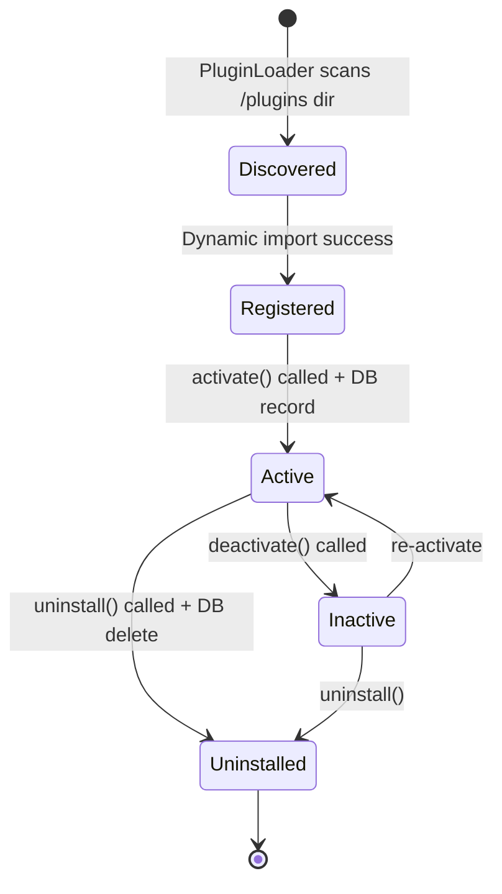

# Plugin System — PreSkool ERP

The PreSkool ERP uses a **Microkernel architecture** for its plugin system, allowing third-party and built-in extensions to integrate with core functionality without modifying the core codebase.

---

## Architecture Overview

```mermaid
graph TB
    subgraph Core["Core Application"]
        App["FastAPI App\n(main.py)"]
        Services["Service Layer\n(30 services)"]
    end

    subgraph PluginSystem["Plugin System (app/plugins/)"]
        Registry["PluginRegistry\n(singleton)\n• activate/deactivate\n• dependency resolution\n• hook dispatch"]
        Loader["PluginLoader\n• filesystem discovery\n• dynamic import\n• auto-activation"]
        Base["PluginBase (ABC)\n• name, version, description\n• setup() / teardown()\n• execute_hook()"]
        HookType["HookType Enum\n18 lifecycle events"]
        Context["PluginContext\n• db_factory\n• logger\n• config store"]
    end

    subgraph Plugins["Installed Plugins"]
        BP["birthday_notifications.py\n(Built-in)"]
        AA["attendance_alerts.py\n(Built-in)"]
        Custom["custom_plugin.py\n(User-created)"]
    end

    subgraph DB["Database"]
        PR["plugins table\n(PluginRecord)"]
    end

    App -->|startup: load + activate| Loader
    Loader -->|discover + import| Plugins
    Loader -->|register| Registry
    Services -->|dispatch_hook(HookType, **data)| Registry
    Registry -->|call execute_hook()| Plugins
    Registry <-->|persist state| PR
    Registry -->|inject| Context
    Context --> Plugins
```

---

## Hook Types (18 Events)

| HookType | When Triggered | Use Cases |
|----------|---------------|-----------|
| `BEFORE_STUDENT_CREATE` | Before saving new student | Validation, enrichment |
| `AFTER_STUDENT_CREATE` | After student saved | Welcome email, notifications |
| `BEFORE_ATTENDANCE_MARK` | Before attendance saved | Validation |
| `AFTER_ATTENDANCE_MARK` | After attendance saved | Alerts to parents |
| `BEFORE_EXAM_CREATE` | Before exam created | Conflict checking |
| `AFTER_EXAM_CREATE` | After exam created | Notifications |
| `BEFORE_FEE_PAYMENT` | Before payment processed | Fraud check |
| `AFTER_FEE_PAYMENT` | After payment confirmed | Receipt email |
| `BEFORE_GRADE_SUBMIT` | Before grade recorded | Range validation |
| `AFTER_GRADE_SUBMIT` | After grade saved | Parent notification |
| `BEFORE_LEAVE_REQUEST` | Before leave saved | Balance check |
| `AFTER_LEAVE_APPROVE` | After leave approved | Calendar update |
| `DAILY_DIGEST` | Scheduled daily | Reports, summaries |
| `WEEKLY_REPORT` | Scheduled weekly | Analytics |
| `USER_LOGIN` | On successful login | Audit logging |
| `USER_LOGOUT` | On logout | Session cleanup |
| `SYSTEM_STARTUP` | App startup | Init tasks |
| `SYSTEM_SHUTDOWN` | App shutdown | Cleanup |

---

## Plugin Lifecycle



---

## Creating a Plugin

### Step 1: Create the File

Place your plugin in `backend/app/plugins/my_plugin.py`:

```python
from app.plugins import PluginBase, PluginMetadata, PluginContext, HookType


class MyPlugin(PluginBase):
    
    metadata = PluginMetadata(
        name="my_plugin",
        version="1.0.0",
        description="Does something awesome",
        author="Your Name",
        dependencies=[],  # other plugin names required
    )
    
    def setup(self, context: PluginContext) -> None:
        """Called when plugin is activated."""
        self.context = context
        self.logger = context.logger
        self.logger.info("MyPlugin activated!")
    
    def teardown(self) -> None:
        """Called when plugin is deactivated."""
        self.logger.info("MyPlugin deactivated.")
    
    def execute_hook(self, hook: HookType, **data) -> None:
        """Handle hook events."""
        
        if hook == HookType.AFTER_STUDENT_CREATE:
            student = data.get("student")
            self._send_welcome_notification(student)
        
        elif hook == HookType.AFTER_ATTENDANCE_MARK:
            absent_students = data.get("absent_students", [])
            self._alert_parents(absent_students)
    
    def _send_welcome_notification(self, student):
        """Internal helper method."""
        db = self.context.get_db()
        # ... your logic ...
        db.close()
    
    def _alert_parents(self, students):
        """Alert parents of absent students."""
        # ... your logic ...
        pass
```

### Step 2: Plugin Config (Optional)

To make your plugin configurable via the Admin UI, use `PluginContext.config`:

```python
def setup(self, context: PluginContext) -> None:
    self.context = context
    self.threshold = context.get_config("alert_threshold", default=3)

def execute_hook(self, hook, **data):
    if hook == HookType.AFTER_ATTENDANCE_MARK:
        if data.get("absent_count", 0) >= self.threshold:
            self._send_alert(data)
```

Admins can update plugin config via `PUT /api/v1/plugins/{name}/config`.

### Step 3: Auto-Discovery

The `PluginLoader` automatically discovers Python files in `app/plugins/`. On startup, `main.py` calls:

```python
loader = PluginLoader()
loader.discover_and_load(auto_activate=True)
```

Your plugin will be found, imported, and activated automatically.

---

## Built-in Plugins

### `birthday_notifications.py`
- **Hooks**: `DAILY_DIGEST`
- **Behavior**: Queries all students and teachers born today, sends birthday notifications

### `attendance_alerts.py`
- **Hooks**: `AFTER_ATTENDANCE_MARK`
- **Behavior**: On each attendance mark, alerts parents via notification if student absent

---

## Plugin API

Manage plugins via the Admin dashboard or API:

| Action | Endpoint |
|--------|---------|
| List plugins | `GET /api/v1/plugins` |
| View plugin details | `GET /api/v1/plugins/{name}` |
| Activate | `POST /api/v1/plugins/{name}/activate` |
| Deactivate | `POST /api/v1/plugins/{name}/deactivate` |
| Update config | `PUT /api/v1/plugins/{name}/config` |
| Uninstall | `DELETE /api/v1/plugins/{name}` |
| View hooks | `GET /api/v1/plugins/hooks` |
