# System Overview — PreSkool ERP

PreSkool ERP is a **multi-tenant, role-based school management platform** built with a React frontend and a FastAPI backend. It manages the complete lifecycle of an educational institution through 31 modules and 313 API endpoints.

---

## Tech Stack

| Layer | Technology |
|-------|-----------|
| **Frontend** | React 18, TypeScript, Vite, MUI (Material UI), Redux Toolkit |
| **Backend** | Python 3.11, FastAPI, SQLAlchemy, Alembic, Pydantic v2 |
| **Database** | SQLite (dev) / PostgreSQL (prod) |
| **Auth** | JWT (access + refresh tokens), bcrypt |
| **Observability** | Prometheus, Grafana, OpenTelemetry / Jaeger |
| **Containerization** | Docker, Docker Compose |
| **Orchestration** | Kubernetes, Helm |
| **IaC** | Terraform |
| **CI/CD** | GitLab CI, GitHub Actions |
| **Reverse Proxy** | Nginx |
| **Payments** | Razorpay SDK |
| **Plugin System** | Microkernel (18 lifecycle hooks) |

---

## System Context Diagram

```mermaid
graph TB
    subgraph Users["👥 Users"]
        Admin["🛠️ Admin"]
        Teacher["📚 Teacher"]
        Student["🎓 Student"]
        Parent["👨‍👩‍👧 Parent"]
    end

    subgraph PreSkool["PreSkool ERP Platform"]
        FE["⚛️ React Frontend\n(Vite + MUI + Redux)"]
        BE["🚀 FastAPI Backend\n(31 Modules · 313 Endpoints)"]
        DB["🗄️ Database\n(SQLite / PostgreSQL)"]
        Plugin["🔌 Plugin System\n(Microkernel)"]
        Obs["📊 Observability\n(Prometheus + Grafana + Jaeger)"]
    end

    subgraph External["🌐 External Services"]
        Razorpay["💳 Razorpay\n(Payments)"]
        Email["📧 Email Service\n(SMTP)"]
        S3["☁️ Cloud Storage\n(S3-compatible)"]
    end

    Admin & Teacher & Student & Parent -->|HTTPS| FE
    FE -->|REST API + JWT| BE
    BE -->|SQLAlchemy ORM| DB
    BE -->|Hook Dispatch| Plugin
    BE -->|Metrics / Traces| Obs
    BE -->|Payment API| Razorpay
    BE -->|Send Notifications| Email
    BE -->|File Upload| S3
```

---

## Module Map

| Domain | Modules |
|--------|---------|
| **Identity** | Auth & Users, Multi-Tenancy |
| **People** | Students, Teachers, Guardians |
| **Academic** | Classes, Subjects, Rooms, Departments, Syllabus, Timetable |
| **Assessment** | Exams, Grades |
| **HRM** | Attendance, Leaves, Payroll |
| **Finance** | Fees, Payments (Razorpay) |
| **Facilities** | Library, Hostel, Transport, Sports |
| **Engagement** | Notifications, Search, File Management |
| **Analytics** | Dashboard, Reports |
| **System** | Settings, Plugins, GDPR, Webhooks |
| **Dashboards** | Student Profile, Teacher Profile, Parent Profile |

---

## Multi-Tenancy Model

Each request is resolved to a **Tenant** via the `X-Tenant-ID` header. The `TenantMiddleware` injects the tenant context into every request. All data is isolated per tenant at the service layer.

---

## Deployment Topology

```mermaid
graph LR
    subgraph Internet
        Browser["🌐 Browser"]
    end

    subgraph K8s["Kubernetes Cluster"]
        Ingress["Nginx Ingress"]
        FE_Pod["Frontend Pod\n(React / Nginx)"]
        BE_Pod["Backend Pod\n(FastAPI / Uvicorn)"]
        DB_Pod["PostgreSQL\n(StatefulSet)"]
        Obs_Stack["Observability\n(Prometheus + Grafana + Jaeger)"]
    end

    Browser --> Ingress
    Ingress --> FE_Pod
    Ingress --> BE_Pod
    BE_Pod --> DB_Pod
    BE_Pod -.->|metrics/traces| Obs_Stack
```

---

## Key Design Decisions

| Decision | Rationale |
|----------|-----------|
| **FastAPI + SQLAlchemy** | High performance, auto-generated OpenAPI docs, type safety |
| **Redux Toolkit** | Predictable state, built-in thunk for async, DevTools |
| **Multi-tenancy via header** | Simple SaaS isolation without database sharding |
| **JWT auth** | Stateless, scalable; refresh tokens for session longevity |
| **Microkernel plugins** | Extensible without core modification; 18 lifecycle hooks |
| **SQLite → PostgreSQL** | Dev simplicity with production upgrade path via Alembic |
| **Prometheus + OTEL** | Full observability: metrics, traces, and structured logs |
