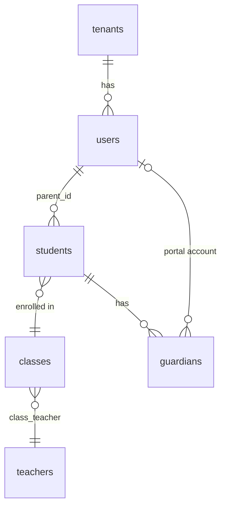
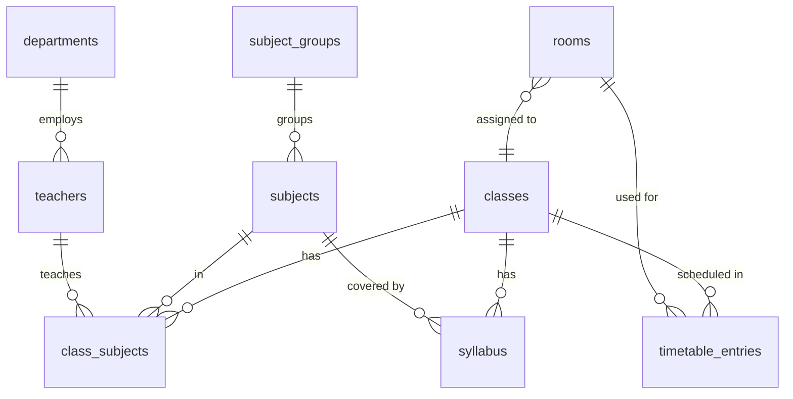
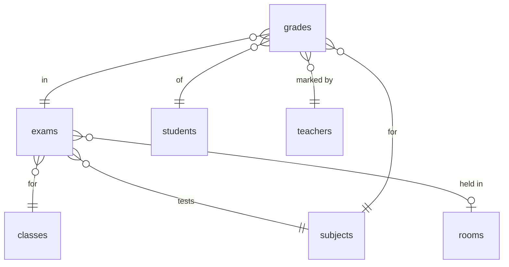
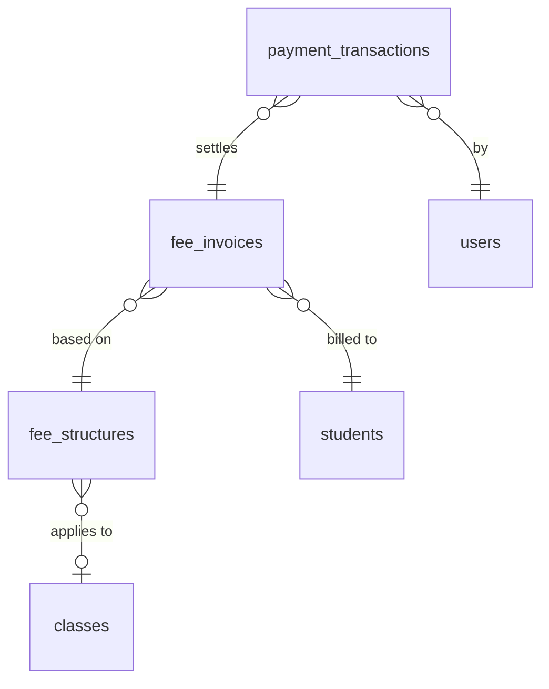
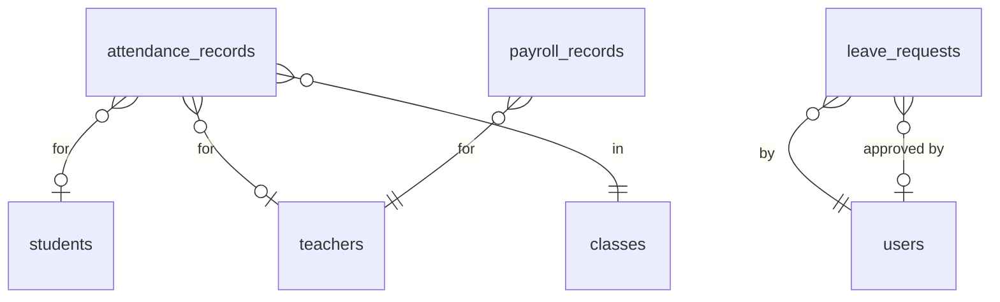

# Database Schema — PreSkool ERP

The system uses **58 database tables** managed by **22 Alembic migrations**. In development, SQLite is used; in production, PostgreSQL is recommended.

All tables inherit from `BaseModel` which adds: `id` (INTEGER PK), `created_at`, `updated_at`, `tenant_id` (multi-tenancy).

---

## Table of Contents

1. [Identity & Auth](#1-identity--auth)
2. [People](#2-people)
3. [Academic](#3-academic)
4. [Assessment](#4-assessment)
5. [HRM](#5-hrm)
6. [Finance](#6-finance)
7. [Facilities](#7-facilities)
8. [System](#8-system)
9. [Entity Relationship Diagrams](#9-entity-relationship-diagrams)

---

## 1. Identity & Auth

### `tenants`

| Column | Type | Constraints |
|--------|------|-------------|
| `id` | VARCHAR(50) | PK |
| `name` | VARCHAR(255) | NOT NULL |
| `domain` | VARCHAR(255) | UNIQUE, NOT NULL, INDEX |
| `is_active` | BOOLEAN | DEFAULT true |

### `users`

| Column | Type | Constraints |
|--------|------|-------------|
| `id` | INTEGER | PK, auto-increment |
| `email` | VARCHAR(255) | UNIQUE, NOT NULL, INDEX |
| `hashed_password` | VARCHAR(255) | NOT NULL |
| `full_name` | VARCHAR(255) | NOT NULL |
| `role` | VARCHAR(20) | NOT NULL — `admin\|teacher\|student\|parent` |
| `is_active` | BOOLEAN | DEFAULT true |
| `is_verified` | BOOLEAN | DEFAULT false |
| `tenant_id` | VARCHAR(50) | FK → tenants.id |
| `created_at` | DATETIME | auto |
| `updated_at` | DATETIME | auto |

---

## 2. People

### `students`

| Column | Type | Constraints |
|--------|------|-------------|
| `id` | INTEGER | PK |
| `student_id` | VARCHAR(50) | UNIQUE, INDEX |
| `first_name` | VARCHAR(100) | NOT NULL |
| `last_name` | VARCHAR(100) | NOT NULL |
| `date_of_birth` | DATE | NOT NULL |
| `gender` | VARCHAR(20) | `male\|female\|other` |
| `email` | VARCHAR(255) | nullable |
| `phone` | VARCHAR(20) | nullable |
| `address` | TEXT | nullable |
| `enrollment_date` | DATE | NOT NULL |
| `class_id` | INTEGER | FK → classes.id, SET NULL |
| `parent_id` | INTEGER | FK → users.id, SET NULL |
| `status` | VARCHAR(20) | `active\|inactive\|graduated\|transferred\|expelled` |
| `photo_url` | VARCHAR(500) | nullable |
| `emergency_contact` | VARCHAR(20) | nullable |
| `emergency_contact_name` | VARCHAR(100) | nullable |
| `medical_info` | TEXT | nullable |
| `tenant_id` | VARCHAR(50) | FK → tenants.id |

### `teachers`

| Column | Type | Constraints |
|--------|------|-------------|
| `id` | INTEGER | PK |
| `employee_id` | VARCHAR(50) | UNIQUE, INDEX |
| `first_name` | VARCHAR(100) | NOT NULL |
| `last_name` | VARCHAR(100) | NOT NULL |
| `date_of_birth` | DATE | nullable |
| `gender` | VARCHAR(20) | nullable |
| `email` | VARCHAR(255) | INDEX |
| `phone` | VARCHAR(20) | nullable |
| `address` | TEXT | nullable |
| `qualification` | VARCHAR(255) | nullable |
| `specialization` | VARCHAR(255) | nullable |
| `joining_date` | DATE | nullable |
| `department_id` | INTEGER | FK → departments.id |
| `status` | VARCHAR(20) | `active\|inactive\|on_leave` |
| `photo_url` | VARCHAR(500) | nullable |
| `salary` | NUMERIC(10,2) | nullable |
| `tenant_id` | VARCHAR(50) | FK → tenants.id |

### `guardians`

| Column | Type | Constraints |
|--------|------|-------------|
| `id` | INTEGER | PK |
| `first_name` | VARCHAR(100) | NOT NULL |
| `last_name` | VARCHAR(100) | NOT NULL |
| `relationship` | VARCHAR(50) | `father\|mother\|guardian\|other` |
| `email` | VARCHAR(255) | nullable |
| `phone` | VARCHAR(20) | NOT NULL |
| `alternate_phone` | VARCHAR(20) | nullable |
| `address` | TEXT | nullable |
| `occupation` | VARCHAR(100) | nullable |
| `student_id` | INTEGER | FK → students.id |
| `user_id` | INTEGER | FK → users.id (portal access) |
| `tenant_id` | VARCHAR(50) | FK → tenants.id |

---

## 3. Academic

### `classes`

| Column | Type | Constraints |
|--------|------|-------------|
| `id` | INTEGER | PK |
| `name` | VARCHAR(100) | NOT NULL |
| `section` | VARCHAR(10) | nullable |
| `year` | INTEGER | nullable |
| `capacity` | INTEGER | nullable |
| `class_teacher_id` | INTEGER | FK → teachers.id |
| `room_id` | INTEGER | FK → rooms.id |
| `academic_year_id` | INTEGER | FK → academic_years.id |
| `tenant_id` | VARCHAR(50) | FK → tenants.id |

### `rooms`

| Column | Type | Constraints |
|--------|------|-------------|
| `id` | INTEGER | PK |
| `room_number` | VARCHAR(20) | NOT NULL |
| `room_type` | VARCHAR(50) | `classroom\|lab\|auditorium\|office` |
| `building` | VARCHAR(100) | nullable |
| `floor` | INTEGER | nullable |
| `capacity` | INTEGER | NOT NULL |
| `is_available` | BOOLEAN | DEFAULT true |
| `facilities` | TEXT | JSON list — e.g., `["projector","AC"]` |
| `tenant_id` | VARCHAR(50) | FK → tenants.id |

### `departments`

| Column | Type | Constraints |
|--------|------|-------------|
| `id` | INTEGER | PK |
| `name` | VARCHAR(100) | NOT NULL |
| `code` | VARCHAR(20) | nullable |
| `description` | TEXT | nullable |
| `head_teacher_id` | INTEGER | FK → teachers.id |
| `tenant_id` | VARCHAR(50) | FK → tenants.id |

### `subjects`

| Column | Type | Constraints |
|--------|------|-------------|
| `id` | INTEGER | PK |
| `name` | VARCHAR(100) | NOT NULL |
| `code` | VARCHAR(20) | nullable |
| `description` | TEXT | nullable |
| `credit_hours` | INTEGER | DEFAULT 1 |
| `subject_group_id` | INTEGER | FK → subject_groups.id |
| `tenant_id` | VARCHAR(50) | FK → tenants.id |

### `subject_groups`

| Column | Type | Constraints |
|--------|------|-------------|
| `id` | INTEGER | PK |
| `name` | VARCHAR(100) | NOT NULL |
| `description` | TEXT | nullable |
| `tenant_id` | VARCHAR(50) | FK → tenants.id |

### `class_subjects` *(join table)*

| Column | Type | Constraints |
|--------|------|-------------|
| `id` | INTEGER | PK |
| `class_id` | INTEGER | FK → classes.id |
| `subject_id` | INTEGER | FK → subjects.id |
| `teacher_id` | INTEGER | FK → teachers.id |

### `syllabus`

| Column | Type | Constraints |
|--------|------|-------------|
| `id` | INTEGER | PK |
| `class_id` | INTEGER | FK → classes.id |
| `subject_id` | INTEGER | FK → subjects.id |
| `title` | VARCHAR(255) | NOT NULL |
| `description` | TEXT | nullable |
| `document_url` | VARCHAR(500) | nullable |
| `academic_year` | VARCHAR(20) | nullable |
| `completion_percentage` | INTEGER | DEFAULT 0 |
| `topics` | TEXT | JSON list |
| `tenant_id` | VARCHAR(50) | FK → tenants.id |

### `timetable_entries`

| Column | Type | Constraints |
|--------|------|-------------|
| `id` | INTEGER | PK |
| `class_id` | INTEGER | FK → classes.id |
| `subject_id` | INTEGER | FK → subjects.id |
| `teacher_id` | INTEGER | FK → teachers.id |
| `room_id` | INTEGER | FK → rooms.id |
| `day_of_week` | VARCHAR(10) | `monday\|tuesday\|...` |
| `start_time` | VARCHAR(10) | e.g., `09:00` |
| `end_time` | VARCHAR(10) | e.g., `10:00` |
| `period_number` | INTEGER | nullable |
| `tenant_id` | VARCHAR(50) | FK → tenants.id |

---

## 4. Assessment

### `exams`

| Column | Type | Constraints |
|--------|------|-------------|
| `id` | INTEGER | PK |
| `name` | VARCHAR(255) | NOT NULL |
| `exam_type` | VARCHAR(50) | `midterm\|final\|quiz\|assignment\|practical` |
| `class_id` | INTEGER | FK → classes.id |
| `subject_id` | INTEGER | FK → subjects.id |
| `exam_date` | DATE | nullable |
| `duration_minutes` | INTEGER | nullable |
| `total_marks` | INTEGER | NOT NULL |
| `passing_marks` | INTEGER | nullable |
| `room_id` | INTEGER | FK → rooms.id |
| `description` | TEXT | nullable |
| `status` | VARCHAR(20) | `scheduled\|ongoing\|completed\|cancelled` |
| `tenant_id` | VARCHAR(50) | FK → tenants.id |

### `grades`

| Column | Type | Constraints |
|--------|------|-------------|
| `id` | INTEGER | PK |
| `student_id` | INTEGER | FK → students.id |
| `exam_id` | INTEGER | FK → exams.id |
| `subject_id` | INTEGER | FK → subjects.id |
| `marks_obtained` | NUMERIC(5,2) | nullable |
| `grade_letter` | VARCHAR(5) | `A+\|A\|B+\|B\|C\|D\|F` |
| `grade_points` | NUMERIC(3,2) | nullable |
| `remarks` | TEXT | nullable |
| `is_absent` | BOOLEAN | DEFAULT false |
| `teacher_id` | INTEGER | FK → teachers.id |
| `tenant_id` | VARCHAR(50) | FK → tenants.id |

---

## 5. HRM

### `attendance_records`

| Column | Type | Constraints |
|--------|------|-------------|
| `id` | INTEGER | PK |
| `student_id` | INTEGER | FK → students.id, nullable |
| `teacher_id` | INTEGER | FK → teachers.id, nullable |
| `class_id` | INTEGER | FK → classes.id |
| `date` | DATE | NOT NULL |
| `status` | VARCHAR(20) | `present\|absent\|late\|excused` |
| `marked_by` | INTEGER | FK → users.id |
| `notes` | TEXT | nullable |
| `tenant_id` | VARCHAR(50) | FK → tenants.id |

### `leave_requests`

| Column | Type | Constraints |
|--------|------|-------------|
| `id` | INTEGER | PK |
| `user_id` | INTEGER | FK → users.id |
| `leave_type` | VARCHAR(50) | `sick\|casual\|earned\|maternity\|paternity` |
| `start_date` | DATE | NOT NULL |
| `end_date` | DATE | NOT NULL |
| `days_count` | INTEGER | auto-calculated |
| `reason` | TEXT | NOT NULL |
| `status` | VARCHAR(20) | `pending\|approved\|rejected\|cancelled` |
| `approved_by` | INTEGER | FK → users.id |
| `approved_at` | DATETIME | nullable |
| `rejection_reason` | TEXT | nullable |
| `tenant_id` | VARCHAR(50) | FK → tenants.id |

### `payroll_records`

| Column | Type | Constraints |
|--------|------|-------------|
| `id` | INTEGER | PK |
| `teacher_id` | INTEGER | FK → teachers.id |
| `month` | INTEGER | 1-12 |
| `year` | INTEGER | NOT NULL |
| `basic_salary` | NUMERIC(10,2) | NOT NULL |
| `allowances` | NUMERIC(10,2) | DEFAULT 0 |
| `deductions` | NUMERIC(10,2) | DEFAULT 0 |
| `net_salary` | NUMERIC(10,2) | computed |
| `payment_date` | DATE | nullable |
| `payment_method` | VARCHAR(50) | `bank_transfer\|cash\|cheque` |
| `status` | VARCHAR(20) | `pending\|processed\|paid` |
| `remarks` | TEXT | nullable |
| `tenant_id` | VARCHAR(50) | FK → tenants.id |

---

## 6. Finance

### `fee_structures`

| Column | Type | Constraints |
|--------|------|-------------|
| `id` | INTEGER | PK |
| `name` | VARCHAR(255) | NOT NULL |
| `class_id` | INTEGER | FK → classes.id |
| `fee_type` | VARCHAR(50) | `tuition\|transport\|library\|hostel\|sports\|miscellaneous` |
| `amount` | NUMERIC(10,2) | NOT NULL |
| `frequency` | VARCHAR(20) | `monthly\|quarterly\|annual\|one_time` |
| `due_date_day` | INTEGER | 1-31 |
| `academic_year_id` | INTEGER | FK → academic_years.id |
| `tenant_id` | VARCHAR(50) | FK → tenants.id |

### `fee_invoices`

| Column | Type | Constraints |
|--------|------|-------------|
| `id` | INTEGER | PK |
| `student_id` | INTEGER | FK → students.id |
| `fee_structure_id` | INTEGER | FK → fee_structures.id |
| `amount` | NUMERIC(10,2) | NOT NULL |
| `due_date` | DATE | NOT NULL |
| `paid_amount` | NUMERIC(10,2) | DEFAULT 0 |
| `status` | VARCHAR(20) | `pending\|partial\|paid\|overdue\|waived` |
| `paid_at` | DATETIME | nullable |
| `discount_amount` | NUMERIC(10,2) | DEFAULT 0 |
| `fine_amount` | NUMERIC(10,2) | DEFAULT 0 |
| `tenant_id` | VARCHAR(50) | FK → tenants.id |

### `payment_transactions`

| Column | Type | Constraints |
|--------|------|-------------|
| `id` | INTEGER | PK |
| `fee_invoice_id` | INTEGER | FK → fee_invoices.id |
| `user_id` | INTEGER | FK → users.id |
| `amount` | NUMERIC(10,2) | NOT NULL |
| `payment_method` | VARCHAR(20) | `razorpay\|cash\|bank_transfer\|cheque` |
| `payment_purpose` | VARCHAR(50) | `fee\|hostel\|transport\|other` |
| `status` | VARCHAR(20) | `pending\|success\|failed\|refunded` |
| `razorpay_order_id` | VARCHAR(255) | nullable |
| `razorpay_payment_id` | VARCHAR(255) | nullable |
| `razorpay_signature` | VARCHAR(500) | nullable |
| `receipt_url` | VARCHAR(500) | nullable |
| `refunded_amount` | NUMERIC(10,2) | DEFAULT 0 |
| `refunded_at` | DATETIME | nullable |
| `tenant_id` | VARCHAR(50) | FK → tenants.id |

---

## 7. Facilities

### `library_books`

| Column | Type | Constraints |
|--------|------|-------------|
| `id` | INTEGER | PK |
| `title` | VARCHAR(255) | NOT NULL |
| `author` | VARCHAR(255) | nullable |
| `isbn` | VARCHAR(50) | nullable |
| `category` | VARCHAR(100) | nullable |
| `publisher` | VARCHAR(255) | nullable |
| `publication_year` | INTEGER | nullable |
| `total_copies` | INTEGER | DEFAULT 1 |
| `available_copies` | INTEGER | DEFAULT 1 |
| `shelf_location` | VARCHAR(50) | nullable |
| `description` | TEXT | nullable |
| `tenant_id` | VARCHAR(50) | FK → tenants.id |

### `book_issues`

| Column | Type | Constraints |
|--------|------|-------------|
| `id` | INTEGER | PK |
| `book_id` | INTEGER | FK → library_books.id |
| `user_id` | INTEGER | FK → users.id |
| `issued_date` | DATE | NOT NULL |
| `due_date` | DATE | NOT NULL |
| `returned_date` | DATE | nullable |
| `fine_amount` | NUMERIC(7,2) | DEFAULT 0 |
| `fine_paid` | BOOLEAN | DEFAULT false |
| `status` | VARCHAR(20) | `issued\|returned\|overdue\|lost` |
| `tenant_id` | VARCHAR(50) | FK → tenants.id |

### `hostel_blocks`

| Column | Type | Constraints |
|--------|------|-------------|
| `id` | INTEGER | PK |
| `name` | VARCHAR(100) | NOT NULL |
| `gender` | VARCHAR(10) | `male\|female\|mixed` |
| `warden_id` | INTEGER | FK → teachers.id |
| `total_rooms` | INTEGER | nullable |
| `tenant_id` | VARCHAR(50) | FK → tenants.id |

### `hostel_rooms`

| Column | Type | Constraints |
|--------|------|-------------|
| `id` | INTEGER | PK |
| `block_id` | INTEGER | FK → hostel_blocks.id |
| `room_number` | VARCHAR(20) | NOT NULL |
| `room_type` | VARCHAR(20) | `single\|double\|triple\|dormitory` |
| `capacity` | INTEGER | NOT NULL |
| `current_occupancy` | INTEGER | DEFAULT 0 |
| `floor` | INTEGER | nullable |
| `monthly_rent` | NUMERIC(8,2) | nullable |
| `facilities` | TEXT | JSON list |
| `tenant_id` | VARCHAR(50) | FK → tenants.id |

### `hostel_allotments`

| Column | Type | Constraints |
|--------|------|-------------|
| `id` | INTEGER | PK |
| `student_id` | INTEGER | FK → students.id |
| `room_id` | INTEGER | FK → hostel_rooms.id |
| `check_in_date` | DATE | NOT NULL |
| `check_out_date` | DATE | nullable |
| `status` | VARCHAR(20) | `active\|checked_out\|cancelled` |
| `tenant_id` | VARCHAR(50) | FK → tenants.id |

### `transport_routes`

| Column | Type | Constraints |
|--------|------|-------------|
| `id` | INTEGER | PK |
| `route_name` | VARCHAR(100) | NOT NULL |
| `route_number` | VARCHAR(20) | nullable |
| `start_point` | VARCHAR(255) | NOT NULL |
| `end_point` | VARCHAR(255) | NOT NULL |
| `stops` | TEXT | JSON array of stop names |
| `distance_km` | NUMERIC(6,2) | nullable |
| `estimated_time` | VARCHAR(20) | nullable |
| `monthly_fee` | NUMERIC(8,2) | nullable |
| `tenant_id` | VARCHAR(50) | FK → tenants.id |

### `transport_vehicles`

| Column | Type | Constraints |
|--------|------|-------------|
| `id` | INTEGER | PK |
| `vehicle_number` | VARCHAR(50) | NOT NULL |
| `vehicle_type` | VARCHAR(50) | `bus\|van\|minibus` |
| `capacity` | INTEGER | NOT NULL |
| `driver_name` | VARCHAR(100) | nullable |
| `driver_phone` | VARCHAR(20) | nullable |
| `route_id` | INTEGER | FK → transport_routes.id |
| `insurance_expiry` | DATE | nullable |
| `fitness_expiry` | DATE | nullable |
| `tenant_id` | VARCHAR(50) | FK → tenants.id |

### `transport_enrollments`

| Column | Type | Constraints |
|--------|------|-------------|
| `id` | INTEGER | PK |
| `student_id` | INTEGER | FK → students.id |
| `route_id` | INTEGER | FK → transport_routes.id |
| `pickup_stop` | VARCHAR(255) | nullable |
| `start_date` | DATE | NOT NULL |
| `end_date` | DATE | nullable |
| `status` | VARCHAR(20) | `active\|inactive` |
| `tenant_id` | VARCHAR(50) | FK → tenants.id |

### `sports_activities`

| Column | Type | Constraints |
|--------|------|-------------|
| `id` | INTEGER | PK |
| `name` | VARCHAR(100) | NOT NULL |
| `sport_type` | VARCHAR(50) | `indoor\|outdoor\|aquatic` |
| `coach_id` | INTEGER | FK → teachers.id |
| `schedule` | TEXT | nullable |
| `venue` | VARCHAR(255) | nullable |
| `max_participants` | INTEGER | nullable |
| `tenant_id` | VARCHAR(50) | FK → tenants.id |

### `sports_achievements`

| Column | Type | Constraints |
|--------|------|-------------|
| `id` | INTEGER | PK |
| `student_id` | INTEGER | FK → students.id |
| `activity_id` | INTEGER | FK → sports_activities.id |
| `achievement_type` | VARCHAR(50) | `gold\|silver\|bronze\|participation\|special` |
| `event_name` | VARCHAR(255) | NOT NULL |
| `event_date` | DATE | nullable |
| `description` | TEXT | nullable |
| `tenant_id` | VARCHAR(50) | FK → tenants.id |

---

## 8. System

### `notifications`

| Column | Type | Constraints |
|--------|------|-------------|
| `id` | INTEGER | PK |
| `user_id` | INTEGER | FK → users.id |
| `title` | VARCHAR(255) | NOT NULL |
| `message` | TEXT | NOT NULL |
| `notification_type` | VARCHAR(50) | `info\|warning\|success\|urgent` |
| `is_read` | BOOLEAN | DEFAULT false |
| `read_at` | DATETIME | nullable |
| `action_url` | VARCHAR(500) | nullable |
| `sender_id` | INTEGER | FK → users.id |
| `tenant_id` | VARCHAR(50) | FK → tenants.id |

### `reports`

| Column | Type | Constraints |
|--------|------|-------------|
| `id` | INTEGER | PK |
| `name` | VARCHAR(255) | NOT NULL |
| `report_type` | VARCHAR(50) | `academic\|attendance\|financial\|enrollment\|staff` |
| `parameters` | TEXT | JSON config |
| `result_data` | TEXT | JSON result |
| `generated_by` | INTEGER | FK → users.id |
| `generated_at` | DATETIME | auto |
| `format` | VARCHAR(10) | `json\|csv\|pdf` |
| `tenant_id` | VARCHAR(50) | FK → tenants.id |

### `school_settings`

| Column | Type | Constraints |
|--------|------|-------------|
| `id` | INTEGER | PK |
| `school_name` | VARCHAR(255) | NOT NULL |
| `school_address` | TEXT | nullable |
| `phone` | VARCHAR(20) | nullable |
| `email` | VARCHAR(255) | nullable |
| `logo_url` | VARCHAR(500) | nullable |
| `website` | VARCHAR(255) | nullable |
| `established_year` | INTEGER | nullable |
| `principal_name` | VARCHAR(255) | nullable |
| `academic_year_start` | VARCHAR(10) | e.g., `April` |
| `timezone` | VARCHAR(50) | DEFAULT `Asia/Kolkata` |
| `currency` | VARCHAR(10) | DEFAULT `INR` |
| `tenant_id` | VARCHAR(50) | FK → tenants.id |

### `academic_years`

| Column | Type | Constraints |
|--------|------|-------------|
| `id` | INTEGER | PK |
| `name` | VARCHAR(100) | NOT NULL — e.g., `2025-2026` |
| `start_date` | DATE | NOT NULL |
| `end_date` | DATE | NOT NULL |
| `is_active` | BOOLEAN | DEFAULT false |
| `tenant_id` | VARCHAR(50) | FK → tenants.id |

### `uploaded_files`

| Column | Type | Constraints |
|--------|------|-------------|
| `id` | INTEGER | PK |
| `filename` | VARCHAR(255) | NOT NULL |
| `original_name` | VARCHAR(255) | NOT NULL |
| `file_path` | VARCHAR(500) | NOT NULL |
| `file_size` | INTEGER | bytes |
| `mime_type` | VARCHAR(100) | nullable |
| `doc_type` | VARCHAR(50) | `syllabus\|assignment\|report\|image\|other` |
| `uploaded_by` | INTEGER | FK → users.id |
| `is_public` | BOOLEAN | DEFAULT false |
| `tenant_id` | VARCHAR(50) | FK → tenants.id |

### `plugin_records`

| Column | Type | Constraints |
|--------|------|-------------|
| `id` | INTEGER | PK |
| `name` | VARCHAR(100) | NOT NULL, UNIQUE |
| `version` | VARCHAR(20) | nullable |
| `is_active` | BOOLEAN | DEFAULT false |
| `config` | TEXT | JSON key-value config |
| `installed_at` | DATETIME | auto |
| `tenant_id` | VARCHAR(50) | FK → tenants.id |

### `audit_logs`

| Column | Type | Constraints |
|--------|------|-------------|
| `id` | INTEGER | PK |
| `user_id` | INTEGER | FK → users.id |
| `action` | VARCHAR(100) | e.g., `student.create` |
| `resource_type` | VARCHAR(50) | e.g., `student` |
| `resource_id` | INTEGER | nullable |
| `old_values` | TEXT | JSON — before state |
| `new_values` | TEXT | JSON — after state |
| `ip_address` | VARCHAR(45) | nullable |
| `user_agent` | VARCHAR(500) | nullable |
| `timestamp` | DATETIME | auto |
| `tenant_id` | VARCHAR(50) | FK → tenants.id |

---

## 9. Entity Relationship Diagrams

### People Domain

### Academic Domain

### Assessment Domain

### Finance Domain

### HRM Domain

---

## Alembic Migrations

| # | File | Description |
|---|------|-------------|
| 001 | `001_initial_schema.py` | users, tenants, students, teachers, classes, subjects |
| 002 | `002_admin_models.py` | guardians, rooms |
| 003 | `003_subject_groups.py` | subject_groups, class_subjects |
| 004 | `004_syllabus.py` | syllabus |
| 005 | `005_timetable.py` | timetable_entries |
| 006 | `006_exams.py` | exams |
| 007 | `007_grades.py` | grades |
| 008 | `008_departments.py` | departments |
| 009 | `009_attendance.py` | attendance_records |
| 010 | `010_leaves.py` | leave_requests |
| 011 | `011_payroll.py` | payroll_records |
| 012 | `012_fees.py` | fee_structures, fee_invoices |
| 013 | `013_library.py` | library_books, book_issues |
| 014 | `014_hostel.py` | hostel_blocks, hostel_rooms, hostel_allotments |
| 015 | `015_transport.py` | transport_routes, transport_vehicles, transport_enrollments |
| 016 | `016_sports.py` | sports_activities, sports_achievements |
| 017 | `017_reports.py` | reports |
| 018 | `018_notifications.py` | notifications |
| 019 | `019_files.py` | uploaded_files |
| 020 | `020_settings.py` | school_settings, academic_years, system_preferences |
| 021 | `021_payments.py` | payment_transactions |
| 022 | `022_plugins.py` | plugin_records |
