# PreSkool ERP — Production Deployment SOP

> **Version:** 1.0 | **Last Updated:** 2026-02-20  
> **Audience:** Engineering Lead, DevOps Engineer, On-Call Engineer  
> **Estimated Time:** 30–45 minutes for a standard release

---

## Overview

This SOP covers the end-to-end process for deploying a new release to production. The pipeline is automated via `cd.yml` (GitHub Actions), but this document provides the human oversight steps, go/no-go criteria, and post-deploy validation.

```mermaid
graph LR
    A[Merge to main] --> B[CI passes]
    B --> C[Pre-flight checklist]
    C --> D{Go/No-Go?}
    D -->|Go| E[GitHub: Approve production deploy]
    D -->|No-Go| F[Block & fix]
    E --> G[CD: Build + push images]
    G --> H[CD: K8s rolling deploy]
    H --> I[CD: Run migrations]
    I --> J[Post-deploy smoke test]
    J --> K{Healthy?}
    K -->|Yes| L[✅ Done — notify team]
    K -->|No| M[🔄 Rollback]
```



---

## 1. Pre-requisites

Before starting, confirm:

- [ ] All P1/P2 bugs resolved for this release
- [ ] `main` branch CI green: [GitHub Actions](https://github.com/your-org/preskool-erp/actions)
- [ ] UAT sign-off complete (`docs/uat/uat-test-plan.md`)
- [ ] Security audit passed (`security/checklist/pre-launch-security.md`)
- [ ] Staging deployed and validated ≥ 24 hours ago
- [ ] On-call engineer confirmed and briefed
- [ ] Maintenance window notified to users (if applicable)
- [ ] Rollback plan reviewed: `docs/rollback-runbook.md`

---

## 2. Pre-Flight Checklist (Automated)

Run the automated checklist immediately before triggering the deploy:

```bash
# On the production host or with production env vars:
TARGET_URL=https://erp.preskool.com \
NAMESPACE=preskool \
bash scripts/launch-checklist.sh
```

**Required result:** `✅ READY FOR PRODUCTION DEPLOYMENT`

If any ❌ FAIL is shown, **do not proceed**. Fix the issue and re-run.

### Manual Pre-Flight Checks

```bash
# 1. Confirm you are on the correct branch
git log --oneline -5

# 2. Verify Docker images are tagged correctly in registy
# (Check GitHub Packages for the target SHA)

# 3. Confirm migration count is expected
cd backend && alembic history --verbose | head -5

# 4. Take a pre-deploy backup
make backup   # or: bash backend/scripts/backup.sh
```

---

## 3. Deployment Execution

### Option A: GitHub Actions (Standard)

1. **Go to** [Actions tab](https://github.com/your-org/preskool-erp/actions) → `CD — Deploy`
2. Click **Run workflow** → Environment: `production`
3. **Wait for the approval gate** (configured in GitHub Environments settings)
4. A team lead approves the deployment in the GitHub UI
5. Monitor the job: `Build & Push → Deploy Production → Run Migrations`

### Option B: Manual (Emergency Only)

> ⚠️ Only use this if GitHub Actions is unavailable

```bash
# Set up kubeconfig
export KUBECONFIG=/path/to/production-kubeconfig

# Update image tag in overlay
IMAGE_TAG=$(git rev-parse HEAD)
cd k8s/overlays/production
sed -i "s|newTag:.*|newTag: $IMAGE_TAG|g" kustomization.yaml

# Apply
kubectl apply -k k8s/overlays/production
kubectl -n preskool rollout status deployment/backend --timeout=180s
kubectl -n preskool rollout status deployment/frontend --timeout=60s

# Run migrations
POD=$(kubectl -n preskool get pod -l app=backend -o jsonpath='{.items[0].metadata.name}')
kubectl -n preskool exec "$POD" -- alembic upgrade head
```

---

## 4. Post-Deploy Verification

### Automated Smoke Tests (run automatically by CD pipeline)

```bash
# Verify health endpoint
curl -f https://erp.preskool.com/api/v1/health

# Expected: {"status": "ok", "version": "<sha>", "db": "connected"}
```

### Manual Verification Steps

```bash
# 1. K8s all pods running
kubectl get pods -n preskool

# 2. No error rate spike in Grafana
# → Open: https://grafana.preskool.com/d/preskool-slo
# → Check: Error rate < 0.1%, P95 latency < 1s

# 3. Login works
curl -X POST https://erp.preskool.com/api/v1/auth/login \
  -H "Content-Type: application/json" \
  -d '{"email":"admin@preskool.test","password":"AdminPass1!@#"}' | python3 -m json.tool

# 4. Spot-check key endpoints
curl -H "Authorization: Bearer <token>" https://erp.preskool.com/api/v1/students?page=1 | python3 -m json.tool
```

### Monitoring Windows

| Time | Action |
|------|--------|
| 0–5 min | Watch pod startup, check logs |
| 5–15 min | Monitor error rate in Grafana |
| 15–30 min | Check Loki for unexpected ERRORs |
| 30–60 min | Watch p95 latency trends |
| 1–24 hr | On-call monitors alerts |

---

## 5. Rollback Trigger Criteria

**Initiate rollback immediately if:**
- Error rate > 5% for 2 or more minutes
- P95 latency > 5 seconds
- Any database data corruption detected
- Login/auth endpoints returning 500s
- Any Critical Prometheus alert fires

**How to rollback:**
```bash
bash scripts/rollback.sh   # Interactive rollback
```
See full guide: [`docs/rollback-runbook.md`](./rollback-runbook.md)

---

## 6. Post-Deploy Communication

### On Success

Post in `#preskool-releases`:
```
🚀 PreSkool ERP deployed to Production
📦 Version: <SHA>
🕐 Time: <timestamp>
🧰 By: <name>
✅ All smoke tests passed
📊 Grafana: https://grafana.preskool.com/d/preskool-slo
```

### On Rollback

Post in `#preskool-incidents`:
```
⚠️ PreSkool ERP production deploy ROLLED BACK
📦 Rolled back to: <previous SHA>
🕐 Time: <timestamp>
📋 Reason: <1-line description>
🔗 Incident: <JIRA ticket link>
```

---

## 7. Deployment Record

The CD pipeline writes a deployment record automatically. To view history:

```bash
cat deployment-records/latest.json
ls deployment-records/ | sort | tail -10
```

---

## 8. Contacts

| Role | Responsibility | Contact |
|------|---------------|---------|
| Release Engineer | Execute & monitor deploy | |
| On-Call Primary | Available for incidents | |
| Engineering Lead | Approve production gate | |
| Product Owner | Business-side sign-off | |
